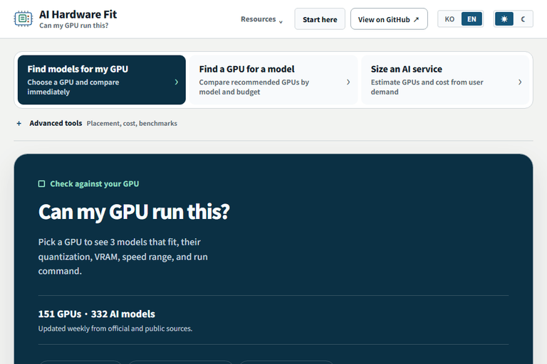

# 내 GPU에서 이 모델이 돌아갈까?

<p align="center">
  
</p>

<p align="center">
  <strong>GPU 하나를 고르면 실행 가능한 AI 모델 3개, 권장 양자화,<br />VRAM·예상 속도와 바로 쓸 수 있는 실행 명령어를 보여줍니다.</strong>
</p>

<p align="center">
  <a href="https://github.com/jaeseok614/ai-hardware-fit/actions/workflows/ci.yml"></a>
  <a href="./LICENSE"></a>
  
  
</p>

<p align="center">
  <a href="https://jaeseok614.github.io/ai-hardware-fit/?lang=ko"><strong>지금 확인하기</strong></a>
  · <a href="https://jaeseok614.github.io/ai-hardware-fit/?lang=ko&amp;gpu=rtx3060-12">RTX 3060 예제</a>
  · <a href="./README.en.md">English</a>
  · <a href="https://github.com/jaeseok614/ai-hardware-fit/issues/new?template=benchmark-report.yml">실측 제보</a>
</p>

<p align="center">
  
</p>

<p align="center">
  <sub>설치 없음 · 로그인 없음 · 입력값 전송 없음 · 계산식과 데이터 공개</sub>
</p>

## 10초 사용법

1. GPU 이름을 검색하거나 목록에서 고릅니다.
2. 실행 가능한 모델 3개와 권장 양자화·VRAM·속도 범위를 확인합니다.
3. `실행 명령어 복사`를 눌러 Ollama 또는 llama.cpp에서 시작합니다.

| 바로 확인 | 결과 |
| --- | --- |
| [RTX 3060 12GB](https://jaeseok614.github.io/ai-hardware-fit/?lang=ko&gpu=rtx3060-12) | 소비자 GPU에서 실행 가능한 로컬 모델 3개 |
| [RTX 5070 Ti 16GB](https://jaeseok614.github.io/ai-hardware-fit/?lang=ko&gpu=rtx5070ti-16) | 16GB VRAM 기준 품질·속도 균형 추천 |
| [RTX 4090 24GB](https://jaeseok614.github.io/ai-hardware-fit/?lang=ko&gpu=rtx4090-24) | 24GB VRAM 기준 대형 모델 후보 |
| [모델부터 GPU 찾기](https://jaeseok614.github.io/ai-hardware-fit/?lang=ko&mode=modelFinder) | 모델·예산·전력 조건에 맞는 GPU 비교 |

## 내 VRAM에서 가장 성능 좋은 모델

벤치마크 시트에 **VRAM–성능 프런티어**를 추가했습니다. `Q4_K_M · 4K context · 동시 요청 1 · llama.cpp` 기준 필요 VRAM을 계산하고, 서로 다른 벤치마크 점수를 섞지 않은 채 같은 공개 지표 안에서만 비교합니다.

- 8·12·16·24·32·48·80·128GB별 최고 점수 모델과 차선 후보
- 더 적은 VRAM으로 같거나 높은 점수를 내는 모델이 없는 프런티어 표시
- 선택한 GPU의 사용 가능 VRAM 기준선과 각 점수의 공식 출처 연결
- [대화형 차트 열기](https://jaeseok614.github.io/ai-hardware-fit/?lang=ko#benchmarkSheet) · [최신 주간 변경 요약](./docs/model-value/latest.md)

## 숫자를 믿어도 되나요?

결과 카드에서 **VRAM 계산**과 **속도 근거**를 분리해 표시합니다.

- `동일 조건 실측`: 같은 GPU·모델·런타임·양자화 조건의 출처 연결 측정값입니다.
- `실측 보정`: 같은 GPU의 측정 표본 중앙값으로 계산 범위를 보정합니다.
- `관련 실측 참고`: 같은 모델의 다른 실행 조건 측정값이 있으며 직접 일치는 아닙니다.
- `실측 없음 · 계산 추정`: 파라미터, VRAM, 메모리 대역폭과 런타임 가정으로 계산합니다.

속도는 보장값이 아니라 계획용 범위입니다. 드라이버, 런타임, 컨텍스트, 배치와 오프로딩에 따라 달라질 수 있으므로 실제 도입 전에는 대표 워크로드로 검증하세요. 자세한 기준은 [정확도와 한계](./docs/accuracy-and-limits.md)와 [계산 방법](./docs/methodology.md)에 공개되어 있습니다.

## 핵심 기능

- NVIDIA·AMD·Intel·Apple Silicon·노트북을 포함한 GPU 프리셋 158종과 직접 사양 입력
- 생성형 LLM, 임베딩, 리랭커, OCR/VLM, 이미지·영상, STT·TTS 모델 347종
- Ollama, llama.cpp, vLLM, MLX 실행 설정과 명령어
- 노트북 TGP, 여러 GPU, 통합 메모리와 시스템 RAM 오프로딩 반영
- GPU·모델 공식 출처, 검증일, 실측 표본과 추정 범위 구분
- 한국어·English, 모바일 UI, 키보드 탐색과 모션 감소 지원

<details>
<summary><strong>고급 도구</strong></summary>

- 모델·예산·폼팩터·전력 기준 GPU 추천
- 여러 LLM·RAG·VLM·음성 모델의 GPU 배치 플래너
- 사용자 수·동시 요청·SLA 기반 AI 인프라 사전 견적
- API·클라우드 GPU·자체 구축 비용과 손익분기점 비교
- Excel·PDF·Docker Compose·공유 링크 산출물

</details>

## 이번 주 GPU

GitHub Actions가 매주 월요일 오전 9시(KST)에 GPU 한 종의 공유 카드와 한·영 게시 문안을 갱신합니다.

- [최신 GPU 스포트라이트](./docs/spotlights/latest.md)
- [전체 스포트라이트 아카이브](./docs/spotlights/README.md)
- [최신 VRAM·모델 가치 리포트](./docs/model-value/latest.md)

## 최근 업데이트

- **v7.38.0** — M5·Rubin·MI455X 7종과 로컬·음성 모델 15종을 추가하고, GPT-6·Claude 5.5·Gemini 3.8·DeepSeek·Mistral의 API 요금 13종을 공식 출처로 검토했습니다. [검토 내역](./docs/releases/v7.38.0.md)
- **v7.37.0** — 모델→GPU 결과에 후보 전체의 가격·속도 프런티어와 GPU별 실행 설정·가격/속도 근거를 추가했습니다.
- **v7.36.0** — 동일 공개 벤치마크 안에서만 비교하는 VRAM–성능 프런티어, VRAM별 추천표와 주간 변경 리포트를 추가했습니다.

전체 기록은 [CHANGELOG](./CHANGELOG.md)에서 확인할 수 있습니다.

## 기여하기

- [GPU 추가 요청](https://github.com/jaeseok614/ai-hardware-fit/issues/new?template=gpu-request.yml)
- [모델 추가 요청](https://github.com/jaeseok614/ai-hardware-fit/issues/new?template=model-request.yml)
- [벤치마크 제보](https://github.com/jaeseok614/ai-hardware-fit/issues/new?template=benchmark-report.yml)
- [계산 오류·사용 흐름 피드백](https://github.com/jaeseok614/ai-hardware-fit/issues/new?template=product-feedback.yml)

## 로컬 개발

Node.js 20 이상이 필요합니다.

```bash
npm install
npm run check
npm run test:visual
```

주요 문서: [데이터 출처](./docs/data-sources.md) · [GPU 기여 파이프라인](./docs/gpu-contribution-pipeline.md) · [변경 이력](./CHANGELOG.md) · [기여 방법](./CONTRIBUTING.md)

저장소 코드는 [MIT License](./LICENSE)를 따르며, 각 AI 모델은 해당 모델의 별도 라이선스를 따릅니다.
