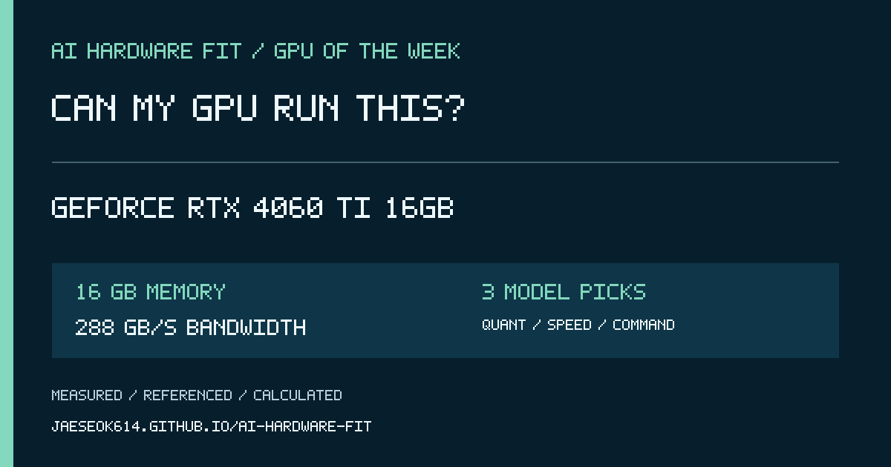

# 2026-10-05 GPU Spotlight — GeForce RTX 4060 Ti 16GB

## 한국어 게시 문안

이번 주 GPU는 **GeForce RTX 4060 Ti 16GB**입니다.

VRAM 16GB, 메모리 대역폭 288GB/s 기준으로 어떤 AI 모델이 들어가고 어떤 양자화가 적절한지, 예상 속도와 실행 명령어까지 한 번에 확인해 보세요.

https://jaeseok614.github.io/ai-hardware-fit/?lang=ko&gpu=rtx4060ti-16

> 속도는 계획용 범위입니다. 결과 화면에서 동일 조건 실측, 실측 보정, 관련 실측, 외부 참고, 계산 추정을 구분해 표시합니다.

## English post copy

This week's GPU is **GeForce RTX 4060 Ti 16GB**.

Can my GPU run this? Check which AI models fit 16 GB of memory, the recommended quantization, expected speed range, and a ready-to-run command.

https://jaeseok614.github.io/ai-hardware-fit/?lang=en&gpu=rtx4060ti-16

> Speed is a planning range, not a guarantee. Each result identifies exact measurements, calibrated estimates, related evidence, external references, or formula-only estimates.

## Source facts

- Memory: 16 GB
- Memory bandwidth: 288 GB/s
- Hardware source: https://www.nvidia.com/en-us/geforce/graphics-cards/40-series/rtx-4060-4060ti/
- Calculator: https://jaeseok614.github.io/ai-hardware-fit/?lang=en&gpu=rtx4060ti-16
